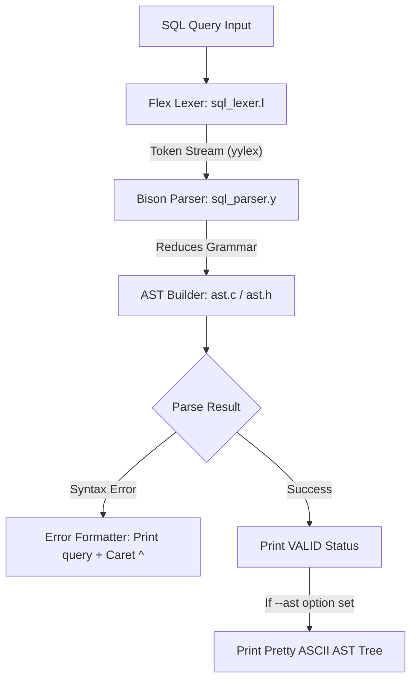

# Implementation Plan: Advanced SQL Query Validator & AST Visualizer (Flex & Bison)

An expanded, feature-rich SQL Query Validator, AST Generator, and Compiler Lab Framework built in C using **Flex** and **Bison**. This expanded version goes beyond simple syntax checking to include **Abstract Syntax Tree (AST) construction & ASCII visualization**, **multi-statement execution**, **rich error diagnostics with carets (`^`)**, and a broad SQL grammar dialect.

---

## 1. Expanded Scope & Features

### A. Comprehensive SQL Grammar Support
1. **DML (Data Manipulation Language)**:
   - **Advanced `SELECT`**:
     - Columns with Aliases (`SELECT u.name AS user_name, u.age`).
     - Subqueries (`WHERE age > (SELECT AVG(age) FROM users)` or `WHERE id IN (...)`).
     - Set operations (`UNION`, `UNION ALL`, `INTERSECT`, `EXCEPT`).
     - Aggregations & `DISTINCT` (`COUNT(DISTINCT category)`, `SUM()`, `AVG()`, `MIN()`, `MAX()`).
     - `CASE WHEN ... THEN ... ELSE ... END` expressions.
     - Advanced predicates: `BETWEEN a AND b`, `LIKE '%pattern%'`, `IN (v1, v2)`, `IS NULL`, `IS NOT NULL`.
     - Full JOIN syntax: `INNER JOIN`, `LEFT OUTER JOIN`, `RIGHT OUTER JOIN`, `CROSS JOIN`, `FULL JOIN` with `ON` / `USING`.
     - `GROUP BY`, `HAVING`, `ORDER BY (ASC/DESC)`, `LIMIT` & `OFFSET`.
   - **`INSERT`**: Single/Multi-row insert, `INSERT INTO ... SELECT ...`.
   - **`UPDATE`**: Assignment lists, expressions, `WHERE` clauses.
   - **`DELETE`**: Single/multi-table delete with `WHERE`.
2. **DDL (Data Definition Language)**:
   - **`CREATE TABLE`**: Column definitions with data types (`INT`, `VARCHAR(n)`, `DECIMAL(p,s)`, `BOOLEAN`, `TIMESTAMP`, `TEXT`, `FLOAT`), constraints (`PRIMARY KEY`, `FOREIGN KEY ... REFERENCES ...`, `NOT NULL`, `UNIQUE`, `DEFAULT`, `CHECK`).
   - **`ALTER TABLE`**: `ADD COLUMN`, `DROP COLUMN`, `RENAME TO`.
   - **`DROP TABLE` / `TRUNCATE TABLE`**: With `IF EXISTS`.
   - **`CREATE INDEX` / `DROP INDEX`**.
3. **TCL (Transaction Control Language)**:
   - `BEGIN`, `COMMIT`, `ROLLBACK`, `SAVEPOINT`.

---

### B. Compiler Design Extensions (Core Lab Highlights)
1. **AST (Abstract Syntax Tree) Construction**:
   - Memory-managed AST node structure in C representing SQL operations (SelectNode, InsertNode, BinaryExpr, SubqueryExpr, ColumnRef, TableRef).
   - Pretty-printed **ASCII Tree Visualizer** (run with `--ast` flag) showing the parsed syntax hierarchy.
2. **Lexical Token Inspection (`--tokens`)**:
   - Verbose mode displaying the token stream generated by Flex (Token Type, Lexeme, Line Number, Position).
3. **Rich Diagnostic Error Reporting**:
   - Shows line number, column number, offending query snippet, and a visual caret (`^`) pointing directly to the syntax error location.
4. **Interactive REPL & Multi-Statement Batch Parser**:
   - Interactive prompt (`sql> `) supporting multi-line queries ending with `;`.
   - Batch script runner parsing whole `.sql` files containing dozens of queries.

---

## 2. Architecture & Pipeline



---

## 3. Proposed Project Structure & Files

```
sql_query_validator/
├── sql_lexer.l        # Flex Lexer (Token definitions, tracking, comments)
├── sql_parser.y       # Bison Parser (Full SQL Grammar, AST construction)
├── ast.h              # AST Node structures & function declarations
├── ast.c              # AST creation, traversal, printing, and memory freeing
├── main.c             # CLI options (--ast, --tokens, -f file), REPL loop
├── Makefile           # Build system
├── test_queries.sql   # Extended test suite (Valid & Invalid queries)
└── run_tests.sh       # Automated test runner with report generation
```

#### [NEW] [`ast.h`](file:///var/home/rasif/projects/CompilerLab/sql_query_validator/ast.h) & [`ast.c`](file:///var/home/rasif/projects/CompilerLab/sql_query_validator/ast.c)
- Defines tree node types: `NODE_SELECT`, `NODE_INSERT`, `NODE_UPDATE`, `NODE_DELETE`, `NODE_CREATE_TABLE`, `NODE_BIN_EXPR`, `NODE_IDENTIFIER`, `NODE_LITERAL`, `NODE_SUBQUERY`, etc.
- Utility functions: `create_node()`, `add_child()`, `print_ast()`, `free_ast()`.

#### [NEW] [`sql_lexer.l`](file:///var/home/rasif/projects/CompilerLab/sql_query_validator/sql_lexer.l)
- Case-insensitive Lexer with column position tracking (`yycolumn`).
- Support for complex literals, escape characters, multi-line comments `/* ... */`, and single-line `--`.

#### [NEW] [`sql_parser.y`](file:///var/home/rasif/projects/CompilerLab/sql_query_validator/sql_parser.y)
- Full-featured Context-Free Grammar.
- Constructs AST nodes on grammar reduction rules.
- Custom `yyerror` with caret error position.

#### [NEW] [`main.c`](file:///var/home/rasif/projects/CompilerLab/sql_query_validator/main.c)
- CLI argument parsing (`-a` / `--ast`, `-t` / `--tokens`, `-v` / `--verbose`, `-f <file>`).
- REPL loop with prompt formatting.

#### [NEW] [`Makefile`](file:///var/home/rasif/projects/CompilerLab/sql_query_validator/Makefile)
- Targets: `all`, `debug`, `test`, `clean`.

#### [NEW] [`test_queries.sql`](file:///var/home/rasif/projects/CompilerLab/sql_query_validator/test_queries.sql) & [`run_tests.sh`](file:///var/home/rasif/projects/CompilerLab/sql_query_validator/run_tests.sh)
- Automated verification script checking valid DML/DDL/TCL, subqueries, joins, and invalid error cases.

---

## 4. Verification Plan

### Automated Tests
1. `make test`: Compiles project and runs `./run_tests.sh`.
2. Tests cover:
   - Complex SELECT queries with subqueries, joins, CASE statements, aggregate functions.
   - CREATE TABLE with multi-column foreign key constraints.
   - Syntax error highlighting verification.
   - AST generation output validation.

### Manual Verification
1. Test interactive REPL: `./sql_validator --ast`
   Input: `SELECT u.id, u.name FROM users u WHERE u.age >= 18;`
   Output:
   ```text
   [SUCCESS] SQL Query is Syntactically Valid!
   
   Abstract Syntax Tree (AST):
   SELECT_STMT
   ├── TARGET_LIST
   │   ├── FIELD: u.id
   │   └── FIELD: u.name
   ├── FROM_CLAUSE
   │   └── TABLE: users (alias: u)
   └── WHERE_CLAUSE
       └── BINARY_OP (>=)
           ├── IDENTIFIER: u.age
           └── LITERAL: 18
   ```
